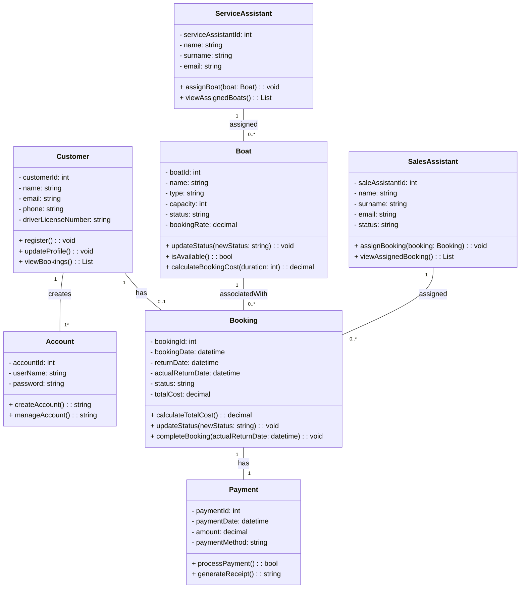

**Assignment 9**

**STUDENT: THABANG MOTAMPANE**

**STUDENT NUMBER: 251699544**

**Boat Rental System**

1\. Entities, Attributes, Relationships, Responsibilities and Business Rules.

**Entity:** Customer

**Attributes:**

\- customerId: int

\- name: string

\- email: string

\- phone: string

\- driverLicenseNumber: string

**Responsibilities:**

\+ register(): void

\+ updateProfile(): void

\+ viewBookings(): List<Booking>

**Entity:** Boat

**Attributes:**

\- boatId: int

\- name: string

\- type: string

\- capacity: int

\- status: string

\- bookingRate: decimal

**Responsibilities:**

\+ updateStatus(newStatus: string): void

\+ isAvailable(): bool

\+ calculateBookingCost(duration: int): decimal

**Entity:** Booking

**Attributes:**

\- bookingId: int

\- bookingDate: datetime

\- returnDate: datetime

\- actualReturnDate: datetime

\- status: string

\- totalCost: decimal

**Responsibilities:**

\+ calculateTotalCost(): decimal

\+ updateStatus(newStatus: string): void

\+ completeBooking(actualReturnDate: datetime): void

**Entity:** Payment

**Attributes:**

\- paymentId: int

\- paymentDate: datetime

\- amount: decimal

\- paymentMethod: string

**Responsibilities:**

\+ processPayment(): bool

\+ generateReceipt(): string

**Entity:** Account

**Attributes:**

\- accountId: int

\- userName: string

\- password: string

**Responsibilities:**

\+ createAccount(): string

\+ manageAccount(): string

**Entity:** Sales Assistant

**Attributes:**

\- saleAssistantId: int

\- name: string

\- surname: string

\- email: string

\- status: string

**Responsibilities:**

\+ assignBooking(booking: Booking): void

\+ viewAssignedBooking(): List<Booking>

**Entity:** Service Assistant

**Attributes:**

\- serviceAssistantId: int

\- name: string

\- surname: string

\- email: string

**Responsibilities:**

\+ assignBoat(boat: Boat): void

\+ viewAssignedBoats(): List<Boat>

**Relationships:**

*   A customer creates an account.
*   A customer makes a booking.
*   A boat is associated with a booking.
*   A booking has a payment.
*   A sales assistant is assigned to a booking.
*   A service assistant is assigned to a boat.

**Business Rules:**

*   A customer can make many bookings, but each booking is for one customer.
*   Each customer can make one account, and each account is for one customer.
*   A booking involves one boat, but a boat can be booked many times over time.
*   Each booking has one payment, and each payment is for one .
*   A sales assistant may be assigned to multiple bookings, and a booking may be handled by one sales assistant.
*   A service assistant may be assigned to multiple boats, and a boat may be handled by one service assistant.

2\. **Class Diagram:** Below is a class diagram for a boat rental system indicating the key relationships between entities written in mermaid.

3\. **Reflection:**

What I’ve learned about this assignment is that creating a class diagram for a boat rental system seems straightforward at first, but there are several challenges and considerations that can complicate things. Deciding which classes should exist in the system and separating them logically can be tricky.

Creating an effective class diagram starts with recognizing which entities in the system should become classes. This can be challenging because too few classes lead to overly broad responsibilities and too many classes can overcomplicate the model. So developing the class diagram required a deep understanding of the domain and user requirements.

Capturing business rules and workflows in a class diagram can also difficult, especially when processes are dynamic or involve conditions like approvals, time limits, or user permissions. This ties into another challenge: balancing simplicity and flexibility. The diagram should be easy to understand, but also flexible enough to accommodate future requirements without needing a major overhaul.

Another major challenge was defining relationships between classes. Accurately modelling associations requires a solid understanding of how different entities interact in the real world. I’ve learned that misjudging these relationships can lead to poor system architecture.

Placing attributes and methods in the right classes was also challenging because some entities can have similar responsibilities which made it difficult to separate their responsibilities. In order to understand a class diagram thoroughly, all entities should have clearly defined roles, and methods should be placed where they logically belong. If not carefully designed, one class may end up doing too much while others remain underutilized.

Finally, another significant limitation is that class diagrams focus on static structure rather than dynamic behaviour. They don't naturally express how objects change state or interact over time, which is why it was important to reflect back to the activity state-transition diagrams created in the previous assignment.
